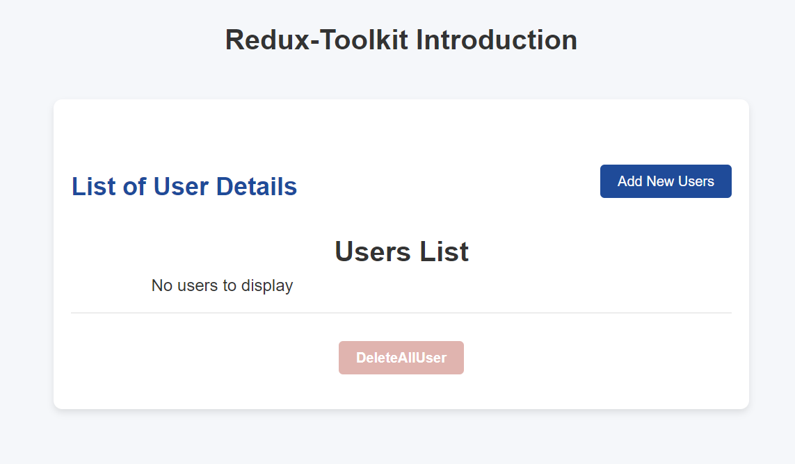
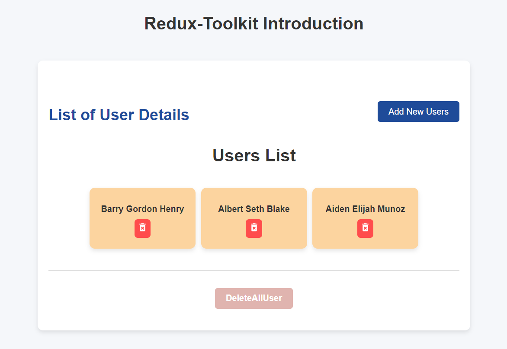
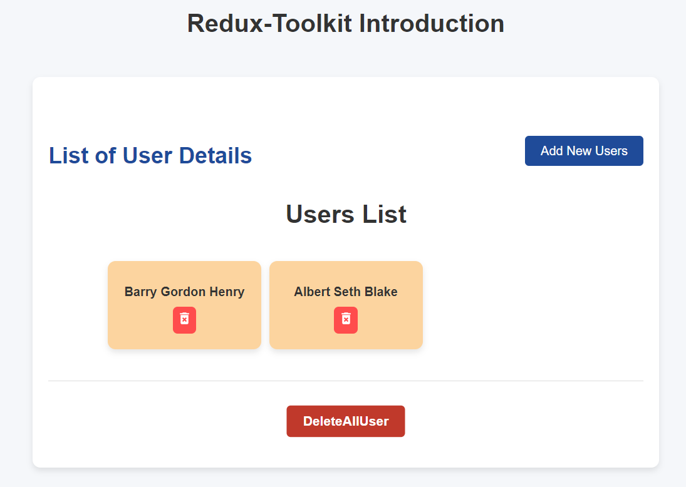

# Redux Toolkit Introduction

## What is Redux Toolkit?

**Redux Toolkit** 
Is the official, recommended toolset for managing state in Redux applications. It simplifies the process of setting up and working with Redux by reducing the boilerplate code typically associated with Redux. With Redux Toolkit, you can efficiently manage global state in your React applications.

## Project Screenshots

Here are some images of the project:

